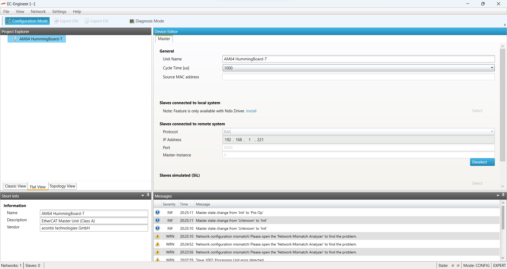

# AM64 SoM EtherCAT Master Support by acontis

SolidRun have partnered with [acontis](https://www.acontis.com/en/) to port their EtherCAT Master stack to AM64 SoC, and to the SolidRun AM64 HummingBoard-T in particular.
For access to evaluation versions, licensing and support please [contact acontis directly](https://www.acontis.com/en/contactform.html).

Below is documentation for a specific demo configuration that has been tested at SolidRun.

## Simple Demo with AM64 Master + AM243 LED & Motor Control Subordinates

### System Overview

The demo consists of 3 physical devices:

1. SolidRun AM64 HummingBoard-T (Master):

   Running Linux + Buildroot + acontis EtherCAT Master stack.
   First RJ45 (eth0) next to barrell connector is used for the local TCP/IP network, to facilitate SSH and acontis EC-Engineer remote access.
   Third RJ45 (eth2) next to USB-A connector is used for the EtherCAT network.

2. TI LaunchPad AM243 (LP-AM243) (Subordinate 1):

   Running TI example firmware for LED control.

3. TI LaunchPad AM243 (LP-AM243) (Subordinate 2)

   Running TI example firmware for CiA402 Motor control.

]

Topology: Master <-> S1 <-> S2

### Subordinate Software Preparation

1. Install [TI AM243 SDK 08.05.00.24](https://software-dl.ti.com/mcu-plus-sdk/esd/AM243X/08_05_00_24/exports/docs/api_guide_am243x/index.html) (e.g. mcu_plus_sdk_am243x_08_05_00_24-linux-x64-installer.run)

2. Compile both `EtherCAT_slave_simple_demo` and `EtherCAT_slave_cia402_demo` projects for LP-AM243, to generate:

   - `EtherCAT_slave_simple_demo_am243x-lp_r5fss0-0_freertos_ti-arm-clang.appimage`
   - `EtherCAT_slave_simple_demo_am243x-lp_r5fss0-0_freertos_ti-arm-clang.appimage_xip`
   - `EtherCAT_slave_cia402_demo_am243x-lp_r5fss0-0_freertos_ti-arm-clang.appimage`
   - `EtherCAT_slave_cia402_demo_am243x-lp_r5fss0-0_freertos_ti-arm-clang.appimage_xip`

   In case `industrial_comms_libs` are not found, apply [this workaround](https://e2e.ti.com/support/microcontrollers/arm-based-microcontrollers-group/arm-based-microcontrollers/f/arm-based-microcontrollers-forum/1184678/lp-am243-import-and-build-EtherCAT_slave_simple_demo-in-mcu_plus_sdk_am243x_08_05_00_24).

### Subordinate Software Installation

Firmware is programmed to the SPI flash permanently to survive power cycles using TI `uart_uniflash.py` tool:

1. Create a configuration file with absolute paths to all involved binaries: uart flash programmer; boot loader; application; xip header:

   ```
   cd mcu_plus_sdk_am243x_08_05_00_24/tools/boot
   cat > flash-slave-demo.cfg << EOF
   --flash-writer=/home/user/mcu_plus_sdk_am243x_08_05_00_24/tools/boot/sbl_prebuilt/am243x-lp/sbl_uart_uniflash.release.tiimage
   --operation=flash-phy-tuning-data
   --file=/home/user/mcu_plus_sdk_am243x_08_05_00_24/tools/boot/sbl_prebuilt/am243x-lp/sbl_ospi.release.tiimage --operation=flash --flash-offset=0x0000
   --file=/home/user/workspace/EtherCAT_slave_simple_demo_am243x-lp_r5fss0-0_freertos_ti-arm-clang/Debug/EtherCAT_slave_simple_demo_am243x-lp_r5fss0-0_freertos_ti-arm-clang.appimage --operation=flash --flash-offset=0x80000
   --file=/home/user/workspace/EtherCAT_slave_simple_demo_am243x-lp_r5fss0-0_freertos_ti-arm-clang/Debug/EtherCAT_slave_simple_demo_am243x-lp_r5fss0-0_freertos_ti-arm-clang.appimage_xip --operation=flash-xip
   EOF
   ```

2. Set Launchpad boot mode to UART: DIP Switches 11100000 (1 = on; 0 = off)

2. Program device at `ttyACM0` according to configuration file:
   ```
   python3 ./uart_uniflash.py \
   --serial-port /dev/ttyACM0 \
   --cfg=flash-slave-demo.cfg
   ```

2. Set Launchpad boot mode to SPI: DIP Switches 01000100 (1 = on; 0 = off)

### Master Software Installation

1. Create bootable microSD:
   - Download https://images.solid-run.com/AM64X/ti_am64x_build/20230723-384041c/microsd-384041c-buildroot.img.xz
   - write microsd-384041c-buildroot.img.xz *block-by-block* to a microsd card, e.g. using [etcher.io](https://etcher.io/)

2. Power-on the unit:
  - Ensure DIP switches are set for microSD (000101 : 0 = off, 1 = on).
   - Insert microSD card
   - Connect uart console to a PC (microUSB connector next to microSD)
   - Connect 12V Power
   - login as "root" user, no password required

3. expand rootfs to fill microSD:

   ```
   # fdisk /dev/mmcblk1

   The number of cylinders for this disk is set to 243096.
   There is nothing wrong with that, but this is larger than 1024,
   and could in certain setups cause problems with:
   1) software that runs at boot time (e.g., old versions of LILO)
   2) booting and partitioning software from other OSs
      (e.g., DOS FDISK, OS/2 FDISK)

   Command (m for help): p
   Disk /dev/mmcblk1: 15 GB, 15931539456 bytes, 31116288 sectors
   243096 cylinders, 4 heads, 32 sectors/track
   Units: sectors of 1 * 512 = 512 bytes

   Device       Boot StartCHS    EndCHS        StartLBA     EndLBA    Sectors  Size Id Type
   /dev/mmcblk1p1    64,0,1      1023,3,32         8192     131071     122880 60.0M  c Win95 FAT32 (LBA)
   /dev/mmcblk1p2    1023,3,32   1023,3,32       131072     344064     212993  104M 83 Linux

   Command (m for help): d
   Partition number (1-4): 2

   Command (m for help): n
   Partition type
      p   primary partition (1-4)
      e   extended
   p
   Partition number (1-4): 2
   First sector (32-31116287, default 32): 131072
   Last sector or +size{,K,M,G,T} (131072-31116287, default 31116287):
   Using default value 31116287

   Command (m for help): p
   Disk /dev/mmcblk1: 15 GB, 15931539456 bytes, 31116288 sectors
   243096 cylinders, 4 heads, 32 sectors/track
   Units: sectors of 1 * 512 = 512 bytes

   Device       Boot StartCHS    EndCHS        StartLBA     EndLBA    Sectors  Size Id Type
   /dev/mmcblk1p1    64,0,1      1023,3,32         8192     131071     122880 60.0M  c Win95 FAT32 (LBA)
   /dev/mmcblk1p2    1023,3,32   1023,3,32       131072   31116287   30985216 14.7G 83 Linux

   Command (m for help): w
   The partition table has been altered.
   Calling ioctl() to re-read partition table
   fdisk: WARNING: rereading partition table failed, kernel still uses old table: Device or resource busy
   # reboot

   ...

   Welcome to Buildroot
   buildroot login: root
   # resize2fs /dev/mmcblk1p2
   resize2fs 1.45.5 (07-Jan-2020)
   Filesystem at /dev/mmcblk1p2 is mounted on /; on-line resizing r[   74.100891] EXT4-fs (mmcblk1p2): resizing filesystem from 106496 to 15492608 blocks
   equired
   old_desc_blocks = 1, new_desc_blocks = 60
   The filesystem on /dev/mmcblk1p2 is now 15492608 (1k) blocks long.

   # df -h /
   Filesystem                Size      Used Available Use% Mounted on
   /dev/root                14.3G     55.2M     13.7G   0% /
   ```

4. Connect to local network / internet:

   ```
   # On common networks using automatic configuration with DHCP protocol:
   udhcpc -i eth0
   ```

5. Enable SSH password login (optional):

An ssh server is preinstalled. To enable root login however, a password must be defined for teh root user:

    # passwd root
    Changing password for root
    New password:
    Retype password:
    passwd: password for root changed by root

Now log-in remote access is possible by `ssh root@<ip>`.

**Note: SSH password login is a security risk. Passwords are commonly bruteforced, especially when connected to the public internet!**

4. Download acontis software to device:

   Please contact acontis for download links, then use `wget` for downloading the following packages to the home directory (`/root`):

   - EC-Master-V3.1.4.11-Linux-ARM_64Bit-Eval.tar.gz
   - EC-Master-ClassA-AddOn-V3.1.4.11-Linux-ARM_64Bit-Eval.tar.gz

   Note that the minimalistic `wget` does not support ssl.
   At the time of writing replacing "http" with "http" in the provided URLs was sufficient.

5. Install acontis software:

   ```
   mkdir -p /opt/acontis
   gzip -dc EC-Master-V3.1.4.11-Linux-ARM_64Bit-Eval.tar.gz | tar -C /opt/acontis -xf -
   gzip -dc EC-Master-ClassA-AddOn-V3.1.4.11-Linux-ARM_64Bit-Eval.tar.gz | tar -C /opt/acontis -xf -
   ```

6. Start EtherCAT master on third RJ45 with remote access enabled:

   ```
   cd /opt/acontis/Bin/Linux/aarch64

   # workaround: always enable eth1 first to avoid "icssg1-eth: settime timeout"
   ifconfig eth1 up

   # limit auto-negotiation to 100Mbps
   ethtool -s eth2 advertise 0xb

   # start interface
   ifconfig eth2 up

   # start master stack
   ./EcMasterDemo -sockraw eth2 -b 1000 -sp 0.0.0.0 -t 0
    ```

   **Note:** The EtherCAT network **must have link before starting the `EcMasterDemo`**, i. e. subordinates connected and powered.
   Otherwise error `Cannot configure EtherCAT-Master: ERROR: Ethernet link cable disconnected (0x9811002d))` is reported.

Now Master is ready for initial configuration using EC-Engineer.

### Master Configuration

#### Generate EtherCAT network description

Generate a network configuration file (*eni.xml*) for the EtherCAT network.
This file can be generated using acontis EC-Engineer application, using remote access over IP.
Please refer to [acontis Documentation](https://developer.acontis.com/EtherCAT-manuals.html) for details.

Configuration also requires importing the TI subordinate descriptions which are part of TI Processor SDK:
- [TI AM243X.R5F CiA402.xml](ethercat-demo/TI AM243X.R5F CiA402.xml)
- [TI AM243X.R5F Simple.xml](ethercat-demo/TI AM243X.R5F Simple.xml)

As long as the EtherCAT network topology is identical to this demo, [this eni.xml](ethercat-demo/eni.xml) (or [ec-engineer project file](ethercat-demo/project.ecc)) can be used as is.
The pictures below give a slideshow overview of this configuration in EC-Engineer:




#### Create Motion Control Configuration

acontis Motion Control Demo requires a special configuration file to describe which drives are available on which subordinate addresses.
An example has been installed at `/opt/acontis/Examples/EcMasterDemoMotion/Config/DemoConfig.xml`.

Required Changes ([XMLNotepad](https://microsoft.github.io/XmlNotepad/) recommended):
- `Config.MotionDemo.NoDCMBusShift=1` (unless network has a time source)
- `Config.MotionDemo.CmdMode=1`
- `Config.MotionDemo.Drive1.Address=1001` (depending on `eni.xml`)
- `Config.MotionDemo.Drive2.Address=0` (disable)
Download [here](ethercat-demo/DemoConfig.xml) the modified version.

Depending on the actual Drive connected to LP-AM243 additional parameters are required.
This specific example had originally been created for a Yaskawa drive.


#### Install EtherCAT network description to target device

The previously created configuration files must be installed on the Master:
- `eni.xml`: `/opt/acontis/Bin/Linux/aarch64/eni.xml`
- `DemoConfig.xml`: `/opt/acontis/Bin/Linux/aarch64/DemoConfig.xml`

Using ssh copy, with `scp` command or FileZilla is recommended:

    scp eni.xml DemoConfig.xml root@<ip>:/opt/acontis/Bin/Linux/aarch64/

### Start EtherCAT Master with Motion Support

```
cd /opt/acontis/Bin/Linux/aarch64

# workaround: always enable eth1 first to avoid "icssg1-eth: settime timeout"
ifconfig eth1 up

# limit auto-negotiation to 100Mbps
ethtool -s eth2 advertise 0xb

# start interface
ifconfig eth2 up

# start master stack with specific network configuration
./EcMasterDemoMotion -sockraw eth2 -b 1000 -sp 0.0.0.0 -t 0 -f eni.xml -cfg DemoConfig.xml
```

#### Notes:

- The EtherCAT network **must have link before starting the `EcMasterDemo`**, i. e. subordinates connected and powered.
  Otherwise error `Cannot configure EtherCAT-Master: ERROR: Ethernet link cable disconnected (0x9811002d))` is reported.

- If MotionDemo had **previously been interrupted, it may not start again** due to `0000013075: Cannot scan bus: ERROR: Time-out (0x98110010)`.
  In this situation Power-Cycle of the subordinates is required.

### Control LEDs & Motor

acontis EC-Engineer facilitates GUI Control of subordinates on the EtherCAT network, via remote access over IP:


### Automatic Startup (unattended)

For Demonstration environments and startup can be automated, with logging and remote access for debugging purposes.

#### Installation

1. auto-start management interface (`eth0`) with dhcp, for remote access by ssh/sftp.

   Append to `/etc/network/interfaces`:

   ```
   auto eth0
   iface eth0 inet dhcp
   ```

2. Install system service:

   ```
   wget -O /opt/acontis/demo.sh https://github.com/SolidRun/Documentation/raw/bsp/am64/ethercat-demo/demo.sh
   wget -O /etc/init.d/S99demo https://github.com/SolidRun/Documentation/raw/bsp/am64/ethercat-demo/demo.init
   chmod 755 /opt/acontis/demo.sh /etc/init.d/S99demo
   ```

#### Usage

- After reboot ethercat demo should **start automatically** as soon as link is detected on interface `eth2`.

- **Logs** are available at `/opt/acontis/demo.log`, `/opt/acontis/demo.log.old`, `/opt/acontis/master*.log` and `/opt/acontis/master-motion*.log`.

- **motion demo** can be **activated** by:

  - install network configuration file `/opt/acontis/Bin/Linux/aarch64/eni.xml`
  - install motion demo configuration file `/opt/acontis/Bin/Linux/aarch64/DemoConfig.xml`
  - create (empty) file `/opt/acontis/motion.txt`

- **motion demo** can be **deactivated** by:

  - delete (empty) file `/opt/acontis/motion.txt`

- remote access recommended via `ssh` or `FileZilla`
